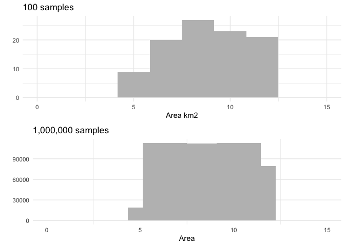
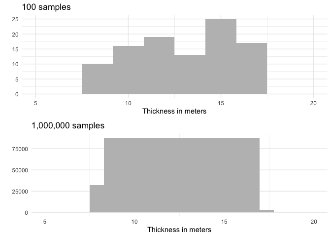
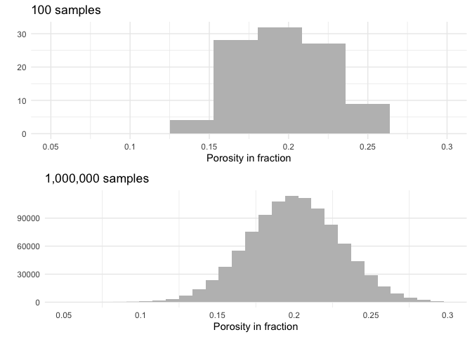
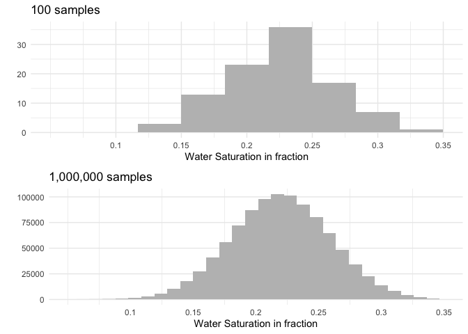
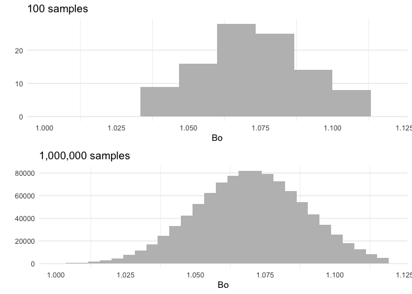
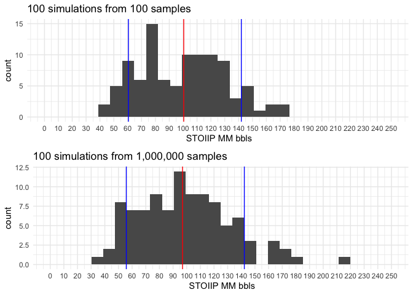
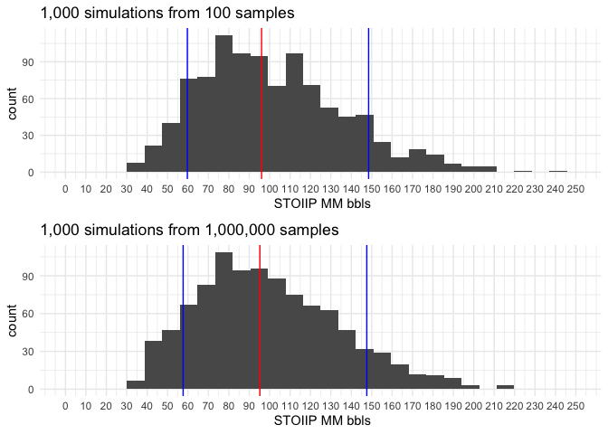
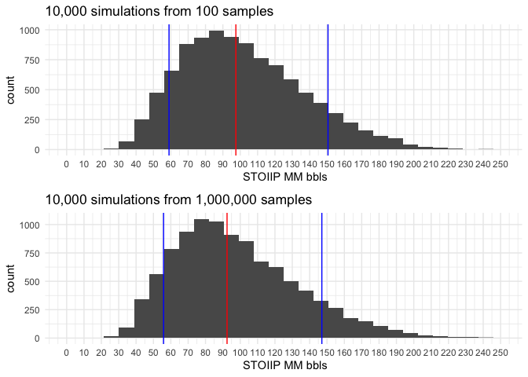
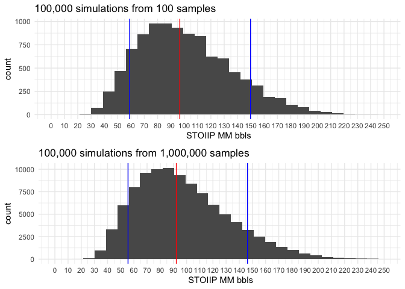
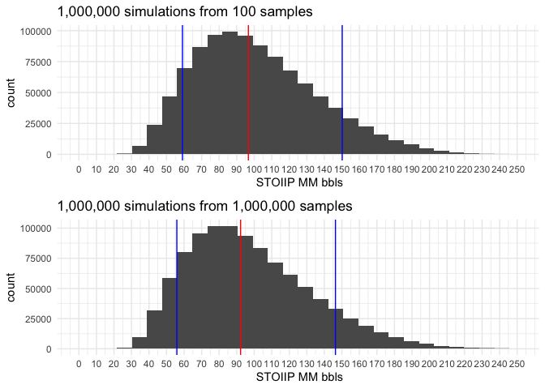

# Montecarlo simulation to estimate STOOIP  

###  Sensitivity to sample size  

## Description  
In this excercise we want to  have a qualitative feel of the performance we can obtain using a Montecarlo simulation to estimate the **STOOIP** on a theoretical field. We will assume two extreme examples:  

* *Dataset 1* will have 100 samples for each parameter  
* *Dataset 2* will have a million samples for each parameter   

In both cases we will explore the resulting distribution of Stooip and compare visually the estimation of P10, P50 and P90 running simulations that vary from 100 to a million simulations.

I will be using the followiing R packages:  

+ [tidyverse](https://www.tidyverse.org/ ), to perform data preparation
+ [gridExtra](https://cran.r-project.org/package=gridExtra) to organize multiple plot outputs.

   

### STOOIP definition

The **STOOIP** is estimated in MM bbls with the following formula:

$ STOOIP = Area * Thickness * Porosity * ( 1 - Sw ) / Bo * Ct $  

where:  

+ **Area** in Km2
+ **Thickness** in meters
+ **Porosity** in fraction
+ **Water Saturation** in fraction
+ **Bo**  is unitless
+ **Ct** is a constant of 6.28 to obtains mmbbls as final unit for **STOOIP**  

**Note**: I  have set a seed at the beginning of the code to allow for reproducibility, changing this values we can compare and realize how stable are the simulations when using different entry values.

 

   

## Distributions used

### Area

The area has been  set as an uniform distribution between 5  and 12 km^2^.    

<!-- -->

### Thickness

Thickness is defined as a uniform distribution between 8 and 17 meters

<!-- -->

### Porosity

Porosity distribution is normal with a mean of 0.2 and 0.03 standard deviation.  

<!-- -->

### Water saturation

Water saturation distribution is normal with a mean of 0.22 and 0.04 standard deviation.  

<!-- -->

### Bo

Bo distribution is normal with a mean of 1.07 and 0.02 standard deviation.  

<!-- -->

## Montecarlo simulations 

The STOOIP is estimated in bbls with the following formula:

$$ STOOIP = Area * Thickness * Porosity * ( 1 - Sw ) / Bo $$  

** Blue ** lines represent **P10** and **P90** and the ** Red ** line the **P50**.

###  100 simulations

<!-- -->

### 1,000 simulations

<!-- -->

### 10,000 simulations

<!-- -->

###  100,000 simulations

<!-- -->

###  1,000,000 simulations

<!-- -->

## Conclusions

There are many conclusions to be made here, however I´will focus on the oints that normally affect my work.  

- outliers or *min* and *max* values are very conditioned by the sample size, as in general in random populations we have a very small chance of capture the entire range, and this is very evident on these examples. 
- the probabilities P10, P50 and P90  stabilize very early on, even with the small dataset. As usual what is good will depend on the impact this estimations will have on future decisions. 

