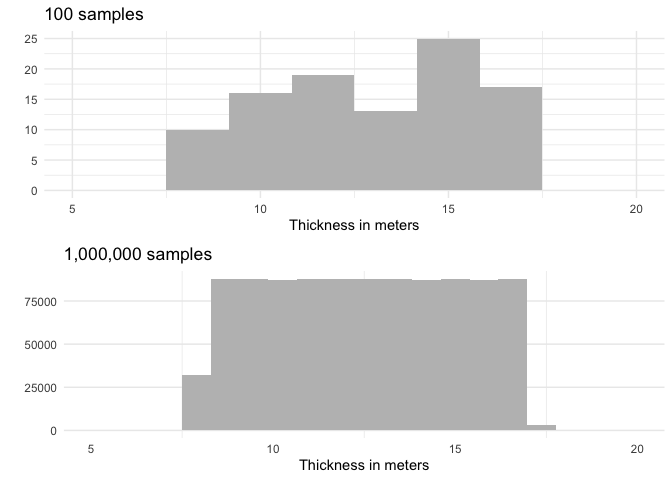
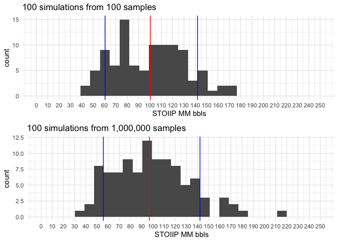
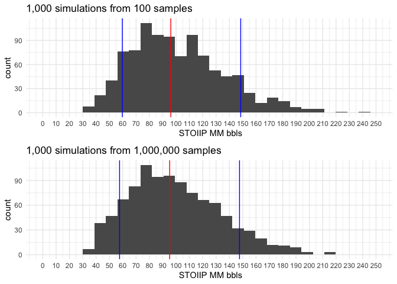
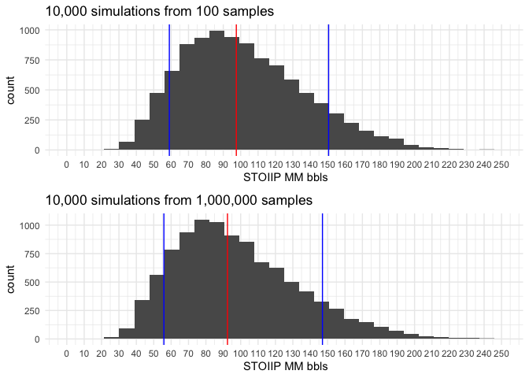
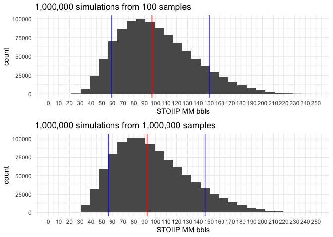

## Description  
This is an excercise to test a montecarlo simulation to estimate the STOOIP of a field, using the [MonteCarlo package](https://cran.r-project.org/web/packages/MonteCarlo/index.html). 
 
We will perform simulations increasing the number of runs drawing data from 2 datasets, both with the same distributions for each parameter, however with different number of samples:  
 
* Dataset 1 will have 100 samples for each parameter
* Dataset 2 will have 1E6 samples for each parameter  

 

## Distributions used

### Area

The area has been  set as an uniform distribution between 5  and 12 km^2^.    

<!-- -->

### Thickness

Thickness is defined as a uniform distribution between 8 and 17 meters

<!-- -->

### Porosity

Porosity distribution is normal with a mean of 0.2 and 0.03 standard deviation.  

<!-- -->

### Water saturation

Water saturation distribution is normal with a mean of 0.22 and 0.04 standard deviation.  

<!-- -->

### Bo

Bo distribution is normal with a mean of 1.07 and 0.02 standard deviation.  

<!-- -->

## Montecarlo simulations 

The STOOIP is estimated in bbls with the following formula:

$$ STOOIP = Area * Thickness * Porosity * ( 1 - Sw ) / Bo $$  

Blue lines represent p10 and p90 and the red line the p50.

###  100 simulations

<!-- -->

### 1,000 simulations

<!-- -->

### 10,000 simulations

<!-- -->

###  100,000 simulations

<!-- -->

###  1,000,000 simulations

<!-- -->

